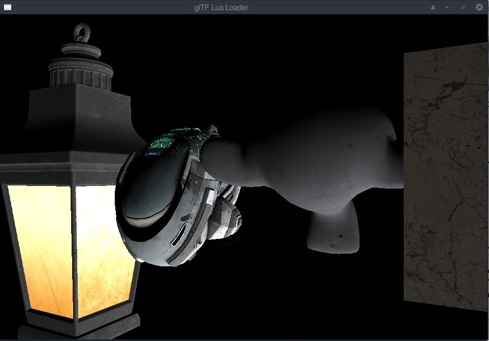
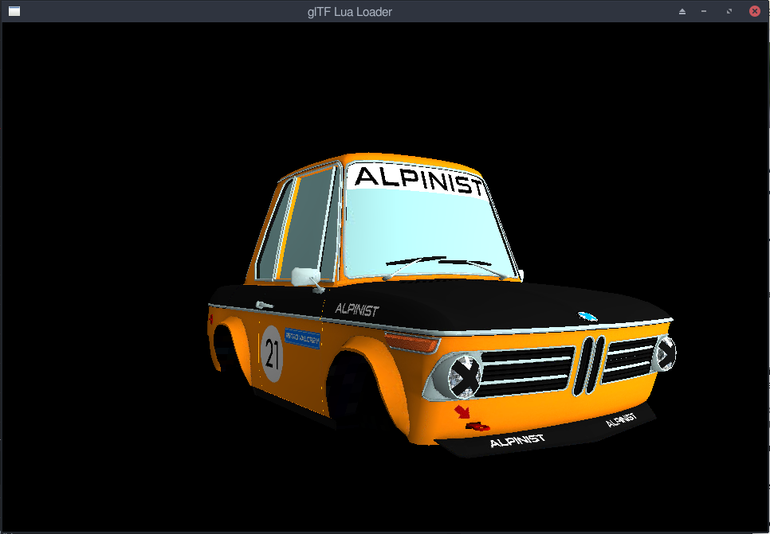

# defold-tools
A suite of tools for use with Defold


## GLTF Loader
This a glTF only loader (no glb support - yet). The loader is limited in scope at the moment but currently supports the following:
- Single mesh loading 
- Albeo, MetallicRoughness, Emissive, Normals texture loading
- Multiple game objects with gltf's (limited to 10, but this can be easily extended) - no dynamic mesh generation.
- Support for fast image and mesh data loading via gltf_extension

Platforms tested and working: Linux, Windows, Android and HTML. 






## Mesh Pool
A simple template type project that only creates a meshpool for use to generate mesh data on the fly. 

You can add the gltfloader for loading meshes, or generator geometry on a mesh. 

Usage:
Create a folder "meshpool" within the assets folder. 
Make sure the images and shaders folder is included in the assets folder.
```
local meshpool = require("meshpool.meshpool")

-- Generate GO_COUNT number of mesh objects built with internal temp data. 
-- The second parameter indicates if you want to create the files or not. It will just initialise only if this is missing.
-- The go is:
--   A mesh + script + shader (pbr) with 4 textures. 
-- These templates can be edited in the meshpool.lua file.
meshpool.init( GO_COUNT, true )
```
The results of this command is a temp.collection file being created, and go,mesh,script and image files created under the meshpool directory.

To use the pool, add the temp.collection to your main collection for your project.

